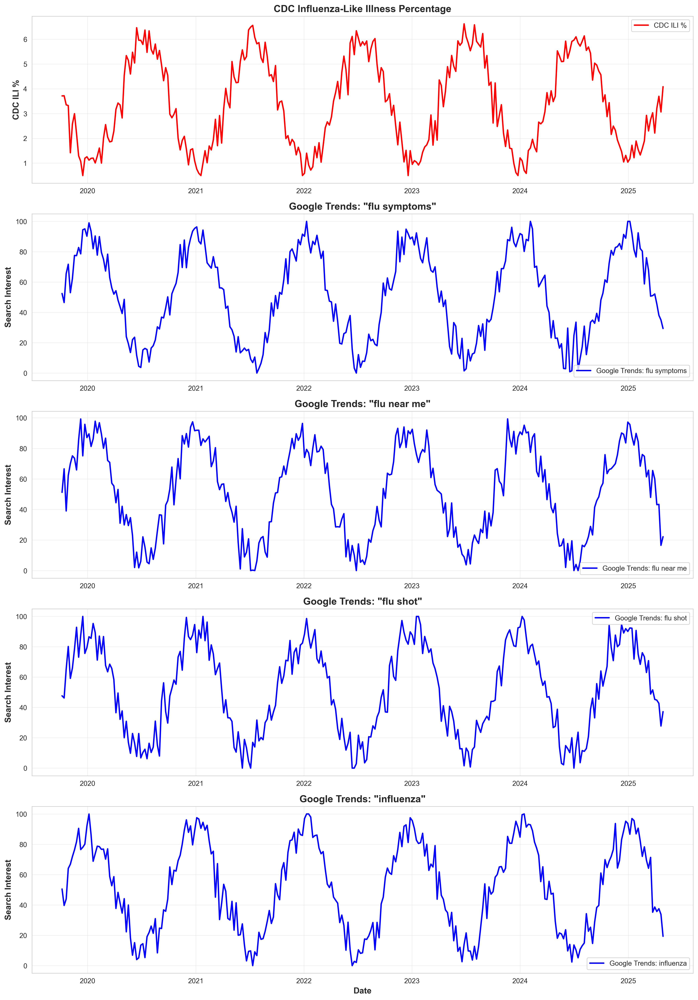
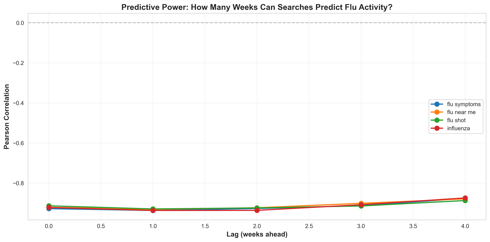

**🌟 Project Highlights**

| Category            | Details                                                                 |
| ------------------- | ----------------------------------------------------------------------- |
| **Purpose**         | Analyze whether Google Trends can act as an early flu indicator         |
| **Datasets**        | Google Trends (search interest) + CDC Influenza-Like Illness data       |
| **Key Skills**      | Time-series analysis, correlation, lag testing, visualization           |
| **Tech Stack**      | Python, Pandas, NumPy, SciPy, Matplotlib                                |
| **Main Finding**    | Google search activity rises **1–2 weeks earlier** than CDC flu reports |
| **Impact**          | Supports early-warning surveillance for public-health planning          |
| **Reproducibility** | Fully local CSV workflow (no API calls, no rate limits)                 |

----------------------------------------------------------

**📝Executive Summary**

Google search interest in various flu-related symptoms showed clear alignment with CDC influenza activity trends with both rising in early winter. Correlation and lag analysis suggest Google Trends may act as a potential early indicator of flu activity. These findings highlight how digital surveillance tools can support public-health planning during flu season.

-----------------------------------------------------------

**🔍Key Insights**

• Flu-related Google searches increased 1–2 weeks before CDC-reported flu activity rose.

• The strongest correlation appeared during peak winter months, showing clear alignment between both data sources.

• Search interest spiked faster than CDC case reporting, suggesting Google Trends may help anticipate rising flu activity.

• Both datasets followed similar seasonal patterns, reinforcing that digital signals can complement traditional surveillance.

-----------------------------------------------------------

**🎯Why This Matters**

Understanding flu trends early can help:

1) Hospitals prepare for patient surges

2) Public-health teams respond faster

3) Communities become aware of rising flu risk

4) Analysts explore how digital data can support disease monitoring

-----------------------------------------------------------

**⚙️Methodology (Overview)**

**Data Collection**

• Imported weekly flu-related search interest from Google Trends

• Loaded weekly influenza activity values from CDC

**Data Cleaning & Preparation**

• Standardized date formats

• Aligned datasets by week

• Handled missing values and ensured consistent time ranges

**Analysis**

• Performed visual trend comparison

• Conducted correlation analysis

• Conducted lag analysis to test whether search patterns lead CDC reports

**Visualization**

• Created time-series plots (Matplotlib)

• Overlaid Google Trends and CDC data to show alignment

• Highlighted peaks and seasonal patterns

**Interpretation**

• Evaluated whether increases in search activity provided early signals

• Identified opportunities for enhanced digital surveillance

-----------------------------------------------------------

**📈Next Steps / Future Work**

1) Expand the dataset to cover multiple years for stronger seasonal analysis

2) Compare Google Trends data with specific flu subtypes or regional trends

3) Explore simple forecasting models to predict flu activity using search patterns

4) Build an interactive dashboard so users can explore trends week by week

5) Integrate more digital signals (Twitter, news, or mobility data) to enhance early-warning systems

-----------------------------------------------------------

**🔧 Tools & Technologies**

• Python

• Pandas, NumPy, SciPy

• Matplotlib, Seaborn

• Time-series alignment & correlation analysis

• Custom DataCollector class

• Local CSV ingestion (no API calls)

-----------------------------------------------------------

## 📊 Visualizations

These plots illustrate the correlation, alignment, and lag patterns between Google Trends and CDC influenza activity.

### Correlation Between Google Trends & CDC ILI 

### Weekly Data Alignment Check

### Lag Correlation Results

-----------------------------------------------------------

**📁 Project Structure**

project-folder/
│── data/
│    ├── google_trends.csv
│    ├── cdc_ili.csv
│── src/
│    ├── data_collector.py
│    ├── analysis.py
│    ├── visualizations.py
│── notebooks/
│    └── flu_analysis.ipynb
│── README.md

